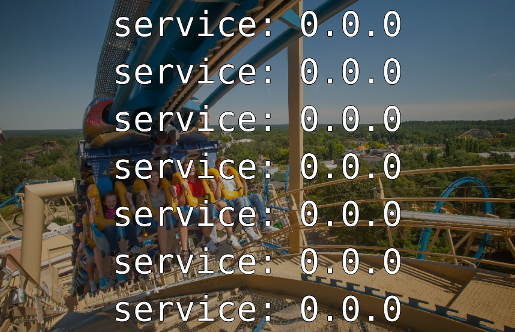

Edit Board > IFrame > IFrame URL: `https://jffz.github.io/inventogory-datadog/?url=<inventogory_url>&team=<team>&env=<env>&bg=<img_url>` > Done > Save Changes

## Parameters

| Parameter  | Default  | Comments  |
|---|---|---|
| <b>url</b>  required | -  | Inventogory endpoint URL without protocol |
| <b>team</b>  required  | -  | Desired team to display  |
| <b>env</b>  required  | -  |  Desired environment to display |
| <b>bg</b> | -  | Background image to display |

## Browser settings
As the javascript is used to gather content from a http endpoint and display it on a SSL secured page, browser will warn about 2 things so we need to disable some security checks.

### Mixed content 
[Chrome](https://stackoverflow.com/questions/18321032/how-to-get-chrome-to-allow-mixed-content)  
[Firefox](https://support.mozilla.org/en-US/kb/mixed-content-blocking-firefox)

### CORS (Cross-Origin Resource Sharing)
[Chrome](https://chrome.google.com/webstore/detail/allow-control-allow-origi/nlfbmbojpeacfghkpbjhddihlkkiljbi?hl=en)  
[Firefox](https://addons.mozilla.org/en-US/firefox/addon/cors-everywhere/)

